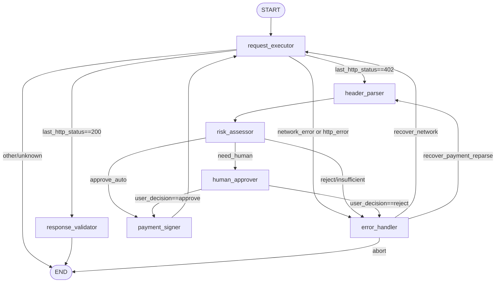

## 1) 总体设计原则（为什么这样拆）

x402 的核心是“**请求 → 402 挑战（PaymentRequired）→ 客户端签名 → 携带支付头重试 → 200 + receipt**”。([docs.cdp.coinbase.com][1])
LangGraph 的核心优势是把这个过程建模为**可循环、可分支、可中断（HITL）、可持久化恢复**的状态机。

因此设计成一个**闭环支付子图**（Payment Subgraph），由 7 个核心节点构成，并用两个关键循环保证可恢复性：

* **循环 A（支付成功路径）**：`payment_signer → request_executor`（携带 `PAYMENT-SIGNATURE` 重试）
* **循环 B（失败/402再次出现路径）**：`request_executor(再次402) → header_parser → risk_assessor → …`

---

## 2) 状态定义（State Schema）

Gemini 方案的 State 已足够；这里补齐几个**实现必需字段**，并把“条件边判定”依赖的字段标注出来。

### 2.1 PaymentContext（支付上下文）

* `target_url: str`
* `http_method: str`（GET/POST；否则 request_executor 无法重放）
* `request_headers: dict`（原始业务请求头，不含支付头）
* `request_body: Optional[Any]`（用于 POST/JSON 等幂等重试）
* `status: str`

  * `idle | payment_required | analyzing | authorized | submitted | success | failed`
* `requirements: Optional[dict]`（解码后的 PaymentRequirements；来自 `PAYMENT-REQUIRED`）([docs.cdp.coinbase.com][1])
* `selected_accept: Optional[dict]`（从 `accepts[]` 中挑选的方案；用于 signer）
* `signed_payload: Optional[str]`（Base64 后的 PaymentPayload；写入 `PAYMENT-SIGNATURE`）([docs.cdp.coinbase.com][1])
* `amount_usdc: float`
* `tx_hash: Optional[str]`（来自 `PAYMENT-RESPONSE`/收据头）([docs.payai.network][2])
* `last_http_status: Optional[int]`（200/402/5xx 等，供路由器使用）
* `error_type: Optional[str]`（用于 error_handler 分流）
* `error_msg: Optional[str]`
* `retry_count: int`（支付相关重试计数）
* `network_retry_count: int`（网络重试计数，避免把网络抖动算进“支付失败”）
* `max_payment_retries: int = 3`
* `max_network_retries: int = 3`

### 2.2 AgentState（全局状态）

* `messages: list`（LLM上下文，可选）
* `payment_ctx: PaymentContext`
* `wallet_balance: float`
* `session_spend: float`
* `budget_limit: float`
* `auto_approve_threshold: float`（例如 0.1 USDC：低于自动通过）
* `human_approval_required: bool`
* `user_decision: Optional[str]`（`approve | reject`）
* `risk_flags: dict`（白名单命中/黑名单/可疑收款地址等）
* `audit_log: list[dict]`（交易与决策审计记录）

---

## 3) 节点列表（Nodes）与输入/输出契约

> 核心就是 Gemini 的 7 个节点；我只把每个节点的**状态读写**写清楚，保证可执行。

### N1. `request_executor`（请求执行器）

**职责**：发起 HTTP 请求；决定是否携带支付头；更新 `last_http_status` 与 `payment_ctx.status`。
**关键 x402 交互点**：

* 首次请求不带支付头，若服务收费返回 402 并在 `PAYMENT-REQUIRED` 头携带要求([docs.cdp.coinbase.com][1])
* 二次请求携带 `PAYMENT-SIGNATURE: <base64 payload>`([docs.cdp.coinbase.com][1])

**读**：

* `payment_ctx.target_url/http_method/request_headers/request_body`
* `payment_ctx.signed_payload`（决定是否注入 `PAYMENT-SIGNATURE`）
* `payment_ctx.retry_count/max_payment_retries`（处理“付了仍 402”）

**写**：

* `payment_ctx.last_http_status`
* 若 200：`payment_ctx.status = success`
* 若 402：`payment_ctx.status = payment_required` 并暂存原始 `PAYMENT-REQUIRED` 头（可放 `requirements_raw`）
* 若 5xx/超时：`payment_ctx.status = failed` + `error_type=network_error`
* 若 4xx（非402）：`failed` + `error_type=http_client_error`

---

### N2. `header_parser`（头解析器）

**职责**：解析 402 的 `PAYMENT-REQUIRED`（base64 JSON），提取 `accepts[]`、金额、网络、币种等，写入 `requirements` 与 `amount_usdc`。([docs.cdp.coinbase.com][1])

**读**：`payment_ctx` 中暂存的 `PAYMENT-REQUIRED` 原始值
**写**：

* `payment_ctx.requirements`
* `payment_ctx.amount_usdc`
* `payment_ctx.status = analyzing`

---

### N3. `risk_assessor`（风险评估器）

**职责**：做“是否支付”的决策（规则+可选LLM），并决定走自动签名还是人工审批。
**规则来源**：预算/单次阈值/白名单/余额等。

**读**：

* `payment_ctx.amount_usdc`
* `wallet_balance/session_spend/budget_limit/auto_approve_threshold`
* `risk_flags`（域名白名单、收款地址信誉等）

**写**：

* `human_approval_required`（True/False）
* `payment_ctx.selected_accept`（从 `requirements.accepts[]` 中挑选最优方案）
* 若拒绝：`payment_ctx.status=failed` + `error_type=policy_reject`

---

### N4. `human_approver`（人机回环）

**职责**：在高风险支付前触发 LangGraph interrupt，等待外部输入恢复执行。
（LangGraph 的 interrupt/HITL 属于常见模式；实现方式可参考 LangGraph 的 HIL 文章/实践。([Towards AI][3])）

**读**：

* `payment_ctx.amount_usdc`
* `payment_ctx.requirements/selected_accept`
* 风险摘要（给人看的解释）

**写**：

* `user_decision = approve | reject`

---

### N5. `payment_signer`（签名器）

**职责**：用 AgentKit/CDP Wallet（或等价钱包 provider）对选定的 `accept` 生成签名与 payload（常见为 EIP-712 / EIP-3009 授权转账），并 Base64 编码写入 `signed_payload`。
Gemini 的“Gasless + Facilitator”依赖于 facilitator 侧可验证并结算（服务器端调用 facilitator /settle）。([docs.cdp.coinbase.com][4])

**读**：

* `payment_ctx.selected_accept`（网络/币种/收款方/金额/scheme）
* `wallet_balance`
* `session_spend`

**写**：

* `payment_ctx.signed_payload`（将来注入 `PAYMENT-SIGNATURE`）([docs.cdp.coinbase.com][1])
* `session_spend += amount_usdc`
* `payment_ctx.status = authorized`

---

### N6. `response_validator`（响应验证器）

**职责**：在 200 OK 后解析支付收据头（如 `PAYMENT-RESPONSE` / `X-PAYMENT-RESPONSE`），落审计日志，并把资源内容写回 `messages` 或业务输出。
（不同实现可能使用不同“receipt header 名称”，但“结算响应头携带交易信息”是常见做法。([docs.payai.network][2])）

**读**：HTTP 200 响应、收据头
**写**：

* `payment_ctx.tx_hash`
* `audit_log += {amount, to, network, tx_hash, timestamp}`
* `payment_ctx.status = success`

---

### N7. `error_handler`（错误处理器）

**职责**：统一处理失败原因：网络重试、支付拒绝后的重新解析、余额不足终止、恶意/异常服务终止等。
**关键点**：把错误分类为可恢复/不可恢复，并决定回到哪个节点。

**读**：

* `payment_ctx.error_type/error_msg`
* `payment_ctx.retry_count/network_retry_count`
* `payment_ctx.last_http_status`

**写**：

* 重试计数（指数退避策略参数也可写入）
* 必要时清理 `signed_payload`（避免重放）
* 选择下一步路由（由条件边实现）

---

## 4) 边连接关系（Edges）与条件边判定

### 4.1 图结构（Mermaid）

---

### 4.2 条件边一览表（可直接实现为 `add_conditional_edges`）

#### Router A：`route_after_request`（REQ → ?）

输入：`state.payment_ctx.last_http_status`, `state.payment_ctx.error_type`

判定：

1. **402 Payment Required**

* 条件：`last_http_status == 402`
* 动作：→ `header_parser`
* 说明：进入 x402 challenge 解析（`PAYMENT-REQUIRED`）。([docs.cdp.coinbase.com][1])

2. **200 OK**

* 条件：`last_http_status == 200`
* 动作：→ `response_validator`

3. **网络或服务端错误**

* 条件：`error_type in {"network_error","http_server_error"}` 或 `last_http_status in {500,502,503,504}`
* 动作：→ `error_handler`

4. **客户端错误（非402）**

* 条件：`last_http_status in {400,401,403,404}`
* 动作：→ `error_handler`（通常不可恢复，但让 ERR 决策）

5. **支付后仍 402（重点边界情况）**
   这不是单独一条边，而是 **REQ 节点内部更新 retry_count** 后仍走 (1)：

* 若 `signed_payload != None` 且 `last_http_status == 402`：

  * 若 `retry_count >= max_payment_retries`：设置 `status=failed, error_type="payment_loop"`，然后 Router A 走到 `error_handler`
  * 否则 `retry_count += 1`，Router A 走到 `header_parser`（重新解析/可能换 accept/换 nonce）

> 这对应 Gemini 文档中“支付后依然402”的死循环保护。([docs.cdp.coinbase.com][5])

---

#### Router B：`route_after_risk`（RISK → ?）

输入：`wallet_balance`, `amount_usdc`, `session_spend`, `budget_limit`, `auto_approve_threshold`, `risk_flags`

判定（按优先级）：

1. **余额不足**

* 条件：`wallet_balance < amount_usdc`
* 动作：→ `error_handler`（error_type="insufficient_balance"）

2. **超预算**

* 条件：`session_spend + amount_usdc > budget_limit`
* 动作：→ `human_approver`（或直接 reject；Gemini 方案是 HITL）

3. **服务不可信/黑名单命中**（建议强制人工或拒绝）

* 条件：`risk_flags.domain_trusted == False` 或 `risk_flags.payee_reputation == "bad"`
* 动作：→ `human_approver` 或 → `error_handler`（policy_reject）

4. **低风险自动通过**

* 条件：`amount_usdc <= auto_approve_threshold` 且 `domain_trusted == True` 且 `session_spend + amount_usdc <= budget_limit`
* 动作：→ `payment_signer`

5. **高风险走人工审批**

* 条件：`amount_usdc > auto_approve_threshold`（或 Gemini 的 1.0 USDC）
* 动作：→ `human_approver`

---

#### Router C：`route_after_human`（HUMAN → ?）

输入：`user_decision`

1. `user_decision == "approve"` → `payment_signer`
2. `user_decision == "reject"` → `error_handler`（error_type="user_reject"）

---

#### Router D：`route_after_error`（ERR → ?）

输入：`error_type`, `retry_count`, `network_retry_count`

推荐分流（可执行且符合 Gemini 的“自我恢复”目标）：

1. **network_error**（可恢复）

* 条件：`error_type=="network_error" and network_retry_count < max_network_retries`
* 动作：`network_retry_count += 1` → `request_executor`（指数退避由 ERR 节点内部执行）

2. **payment_verification_failed / payment_loop**（可尝试重新解析/换 nonce/换 accept）

* 条件：`error_type in {"payment_verification_failed","payment_loop"} and retry_count < max_payment_retries`
* 动作：清理 `signed_payload=None`（防重放），→ `header_parser`

3. **insufficient_balance / policy_reject / user_reject**（不可恢复）

* 条件：`error_type in {"insufficient_balance","policy_reject","user_reject"}`
* 动作：→ `END`

4. **unknown**

* 条件：其他
* 动作：→ `END`（并记录 audit_log）

---

## 5) x402 交互在图中的“落点”总结（确保突出协议调用）

* **402 触发点**：`request_executor` 收到 `402 Payment Required`
* **解析点**：`header_parser` 解码 `PAYMENT-REQUIRED` 并挑选 `accepts[]` ([docs.cdp.coinbase.com][1])
* **签名点**：`payment_signer` 生成并 Base64 的 `PaymentPayload`（对应将写入 `PAYMENT-SIGNATURE`）([docs.cdp.coinbase.com][1])
* **支付重试点**：`payment_signer → request_executor` 回环；REQ 注入 `PAYMENT-SIGNATURE` 头并重放原请求([docs.cdp.coinbase.com][1])
* **结算与收据**：服务端可通过 facilitator 验证/结算（/settle），客户端在 `response_validator` 解析收据头并落审计([docs.cdp.coinbase.com][6])

---

## 6) 你可以直接写进设计文档的“节点清单 + 边清单”

### 节点清单

1. `request_executor`
2. `header_parser`
3. `risk_assessor`
4. `human_approver`（interrupt）
5. `payment_signer`
6. `response_validator`
7. `error_handler`

### 边清单（含条件）

* `START → request_executor`
* `request_executor → header_parser` 条件：`last_http_status==402` ([docs.cdp.coinbase.com][1])
* `request_executor → response_validator` 条件：`last_http_status==200`
* `request_executor → error_handler` 条件：`error_type!=None` 或 `last_http_status in 4xx/5xx（非200/402）`
* `header_parser → risk_assessor`（无条件）
* `risk_assessor → payment_signer` 条件：余额足 + 未超预算 + 低风险（≤auto_approve_threshold）
* `risk_assessor → human_approver` 条件：超预算 或 高风险 或 不可信服务
* `risk_assessor → error_handler` 条件：余额不足 或 策略拒绝
* `human_approver → payment_signer` 条件：`user_decision=="approve"`
* `human_approver → error_handler` 条件：`user_decision=="reject"`
* `payment_signer → request_executor`（无条件回环，执行“带支付头重试”）([docs.cdp.coinbase.com][1])
* `response_validator → END`
* `error_handler → request_executor` 条件：`network_error && network_retry_count<max_network_retries`
* `error_handler → header_parser` 条件：`payment_verification_failed/payment_loop && retry_count<max_payment_retries`
* `error_handler → END` 条件：不可恢复错误或重试耗尽

# **Web3场景下的自动化支付Agent设计：基于x402协议与LangGraph框架的深度架构研究报告**

## **1\. 执行摘要**

随着大语言模型（LLM）能力的飞跃，人工智能正在从被动的对话工具向具备自主推理、规划与执行能力的“智能体（Agent）”演进。然而，当前的智能体在互联网经济活动中面临着显著的“价值旁路（Value Bypass）”问题：智能体虽然能够以超人的速度处理信息，但受限于Web2时代基于身份账户（Account-Based）和信用卡订阅的支付基础设施，它们无法独立、即时地为所获取的数据、API服务或计算资源付费。这种经济能力的缺失，成为了智能体实现完全自主化的“最后一公里”障碍。

本报告旨在提出一套完整的技术解决方案，设计一种基于**x402协议**与**LangGraph框架**的自动化支付Agent架构。**x402协议**是由Coinbase牵头提出的开放标准，旨在复活HTTP协议中长期闲置的402 Payment Required状态码，利用EVM兼容链（如Base）和稳定币（如USDC）实现无摩擦的机器间（M2M）支付 1。与基于比特币闪电网络的L402协议不同，x402利用了更广泛的Web开发者熟悉的RESTful范式和以太坊生态的签名标准（EIP-712/EIP-3009），通过“促进者（Facilitator）”模式抽象了Gas费和区块链交互的复杂性，使Agent仅需持有私钥即可完成支付 3。

为了有效管控支付流程中的复杂状态流转、错误重试与风险控制，本设计引入了**LangGraph框架**。LangGraph将Agent的运行逻辑建模为有向有环图（StateGraph），允许设计包含循环（Loops）、条件分支（Conditional Edges）和人机回环（Human-in-the-Loop）的复杂工作流 4。本报告详细阐述了如何利用LangGraph构建具备“经济感知能力”的Agent状态机，设计了包括资源请求、支付分析、风险评估、签名执行及验证在内的核心节点，并结合**Coinbase AgentKit**提供的链上交互能力，构建了一个安全、可审计且具备自我恢复能力的自动化支付系统。

## ---

**2\. 背景与动机：迈向Agent原生经济**

### **2.1 互联网的“原罪”与HTTP 402的复兴**

互联网协议的设计者Tim Berners-Lee及其同僚在制定HTTP标准时，曾预见到原生支付层的必要性，并为此预留了状态码**402 Payment Required** 6。然而，受限于当时数字货币技术的缺失，这一状态码在随后的三十年里几乎处于休眠状态。互联网转而发展出了基于广告的注意力经济和基于订阅的围墙花园（Walled Gardens）。

这种Web2的经济架构对AI Agent极不友好：

* **身份验证壁垒**：订阅服务通常需要邮箱验证、手机号绑定甚至KYC（了解你的客户）流程，Agent难以独立完成。  
* **支付粒度不匹配**：Agent的高频调用往往对应极小价值（例如单次API调用仅需$0.001），传统支付网关（如Stripe）的高额固定手续费（$0.30 \+ 2.9%）使得此类微支付在经济上不可行 7。  
* **交互摩擦**：管理成百上千个API Key对于开发者而言是巨大的运维负担，限制了Agent动态发现和使用新服务的能力。

**x402协议**的提出正是为了解决这一“原罪”。它不创造新的代币，而是标准化了“如何要钱”和“如何付钱”的通信格式，利用稳定币（USDC）作为价值载体，将支付指令直接嵌入HTTP头（Headers）中，实现了无状态、无需注册的即时结算 8。

### **2.2 为什么是x402而非L402？**

在设计Web3支付Agent时，必须清晰区分**x402**与**L402**。虽然两者都旨在利用HTTP 402状态码，但其技术路线迥异：

| 特性维度         | x402 (Coinbase / Standard)               | L402 (Lightning Labs)                      |
| :--------------- | :--------------------------------------- | :----------------------------------------- |
| **底层网络**     | **EVM兼容链** (Base, Polygon等) & Solana | **比特币闪电网络** (Lightning Network)     |
| **结算资产**     | **稳定币 (USDC)**, ERC-20代币            | **比特币 (Satoshis)**                      |
| **鉴权机制**     | **数字签名** (EIP-712 / EIP-3009)        | **Macaroons** (带有加密陷门的Bearer Token) |
| **传输层**       | 标准HTTP头 (PAYMENT-REQUIRED)            | HTTP头 (WWW-Authenticate: L402)            |
| **基础设施要求** | 轻量级 (仅需私钥签名)，依赖Facilitator   | 重量级 (需运行或连接闪电网络节点)          |
| **适用场景**     | B2B API, 企业级Agent, 通用Web服务        | 流支付, 比特币原生应用, 抗审查支付         |
| **开发生态**     | 广泛的Web3/EVM开发者生态 (viem, ethers)  | 相对小众的Bitcoin/Lightning开发栈          |

本报告选择**x402**作为基础协议，主要基于以下考量：

1. **资产稳定性**：商业和API服务更倾向于使用美元锚定的稳定币（USDC）计价，避免比特币的高波动性 3。  
2. **集成便捷性**：x402通过“促进者（Facilitator）”模式，允许服务器端无需运行全节点即可验证支付，降低了服务提供商的接入门槛 10。  
3. **签名标准**：利用EIP-712结构化数据签名，Agent可以清晰地知道自己在签署什么内容，提高了安全性 12。

### **2.3 编排框架的演进：从Chain到Graph**

早期的Agent开发多采用“链式（Chain）”架构（如LangChain的SequentialChain），即线性的步骤执行。然而，涉及金钱交易的流程天然充满不确定性和循环：

* **循环重试**：支付失败需要重试，或者充值后重试。  
* **条件分支**：金额过大需要人工审批，金额小则自动通过。  
* **状态持久化**：在等待区块链确认或人工审批时，Agent的状态需要被安全保存和恢复。

**LangGraph**作为一种基于图论的编排框架，通过节点（Nodes）和边（Edges）定义工作流，并引入了“状态机（State Machine）”的概念。这使得开发者可以显式地定义Agent在不同阶段（如“等待支付”、“支付中”、“验证中”）的行为，并利用持久化存储（Checkpointer）实现长周期的交互 4。这对于构建可靠的金融级Agent至关重要。

## ---

**3\. 核心协议解析：x402原理与规范**

x402协议的核心理念是“基于资源的支付协商”。Agent不需要预先知道某个URL是否收费，只需发起请求，根据响应进行动态处理。

### **3.1 协议交互实体**

x402架构包含四个核心实体 10：

1. **客户端 (Client / Agent)**：  
   * 发起资源请求的主体。  
   * 持有加密钱包（私钥），用于生成支付签名。  
   * 集成了x402客户端SDK，负责解析402响应并构建支付载荷。  
2. **资源服务器 (Resource Server)**：  
   * 提供受保护资源的HTTP服务器。  
   * 部署了x402中间件，负责拦截请求、生成支付需求（PaymentRequirements）并验证支付载荷。  
   * **无状态性**：服务器不需要维护用户的账户余额或会话信息。  
3. **促进者 (Facilitator)**：  
   * 一个可选但推荐的第三方服务（如Coinbase Facilitator）。  
   * **职责**：接收服务器转发的支付载荷，验证签名，将交易提交上链，并支付Gas费（Gas Sponsorship）。  
   * **价值**：将复杂的区块链交互（Nonce管理、Gas估算、重组处理）从资源服务器剥离，使Web2开发者能以Web2的方式（REST API）接收Crypto支付 10。  
4. **区块链网络 (Blockchain Network)**：  
   * 最终的结算层（如Base, Polygon）。  
   * 记录价值转移，确权交易的不可篡改性。

### **3.2 交互流程详解**

标准的x402交互流程遵循“请求-挑战-响应（Request-Challenge-Response）”模式 1：

1. **初始请求（Discovery）**：  
   * Agent发起标准的HTTP GET请求：GET /api/weather。  
2. **支付挑战（Challenge）**：  
   * 服务器检测到未包含支付凭证，返回状态码 402 Payment Required。  
   * 响应头包含 PAYMENT-REQUIRED，其值为Base64编码的JSON对象，描述了支付的具体要求。  
3. **支付构建（Construction）**：  
   * Agent解码JSON，分析价格、币种和收款地址。  
   * Agent利用本地钱包对交易数据进行签名（通常基于EIP-712或EIP-3009标准）。  
   * Agent构建 PaymentPayload，并将其Base64编码。  
4. **支付重试（Execution）**：  
   * Agent重新发起相同的请求：GET /api/weather。  
   * 新增请求头 PAYMENT-SIGNATURE（或 X-PAYMENT），携带签名后的载荷。  
5. **验证与结算（Settlement）**：  
   * 服务器接收请求，提取支付载荷。  
   * 服务器调用Facilitator的API进行验证。Facilitator将交易广播至链上。  
   * 验证通过后，服务器处理业务逻辑。  
6. **资源交付（Delivery）**：  
   * 服务器返回状态码 200 OK 及请求的数据。  
   * 响应头包含 PAYMENT-RESPONSE，携带链上交易哈希作为收据。

### **3.3 数据结构规范**

理解JSON Schema是实现Agent解析逻辑的关键。

#### **3.3.1 PaymentRequirements (服务端 \-\> 客户端)**

JSON

{  
  "x402Version": "1.0",  
  "accepts":  
}

* **多网络支持**：accepts 数组允许服务器提供多种支付选项（例如支持Base上的USDC或Polygon上的USDT），Agent可根据自身持仓选择最优路径 10。

#### **3.3.2 PaymentPayload (客户端 \-\> 服务端)**

JSON

{  
  "x402Version": "1.0",  
  "scheme": "exact",  
  "network": "base",  
  "payload": {  
    "signature": "0xSignatureBytes...", // 用户的加密签名  
    "authorization": {                  // 被签名的数据内容 (EIP-3009 TransferWithAuthorization)  
      "from": "0xAgentAddress...",  
      "to": "0xSellerAddress...",  
      "value": "100000",  
      "validAfter": 1710000000,  
      "validBefore": 1710003600,  
      "nonce": "0xRandomNonce..."       // 防重放攻击的关键  
    }  
  }  
}

* **Gasless机制**：这里的Payload通常对应EIP-3009的TransferWithAuthorization函数。这意味着Agent不需要支付ETH作为Gas费，只需要持有USDC。Facilitator作为“元交易中继者（Meta-Transaction Relayer）”会调用合约并支付Gas，从而极大降低了Agent的持币门槛 11。

## ---

**4\. 系统架构设计：基于LangGraph的支付Agent**

本章节提出一种分层的Agent系统架构，将x402协议的处理逻辑内嵌于LangGraph的状态流转中。

### **4.1 总体架构图**

系统自下而上分为四层：

1. **基础设施层 (Infrastructure Layer)**：  
   * **Blockchain**：Base (L2), Ethereum。  
   * **Facilitator**：Coinbase x402 Facilitator API。  
   * **Wallet Provider**：Coinbase AgentKit (提供私钥管理、签名能力)。  
2. **感知与执行层 (Perception & Action Layer)**：  
   * **HTTP Client Wrapper**：封装了fetch/axios，具备拦截402响应并抛出特定异常的能力。  
   * **Tool Definitions**：定义Agent可调用的工具（如make\_payment, check\_balance）。  
3. **编排层 (Orchestration Layer \- LangGraph)**：  
   * **State Graph**：定义节点（Nodes）和边（Edges）。  
   * **Checkpointer**：使用PostgreSQL或SQLite持久化Agent状态，支持长时运行和断点恢复 18。  
4. **认知层 (Cognition Layer)**：  
   * **LLM (Brain)**：负责决策（是否支付？金额是否合理？）。  
   * **Policy Engine**：基于规则的风险控制（如单日限额）。

### **4.2 LangGraph 状态设计 (State Schema)**

在LangGraph中，状态（State）是节点间传递信息的唯一载体。对于支付Agent，我们需要扩展标准的消息状态，增加金融上下文。

Python

from typing import TypedDict, Annotated, List, Optional, Dict, Any  
import operator

class PaymentContext(TypedDict):  
    """支付上下文，用于在循环中传递支付信息"""  
    target\_url: str  
    status: str  \# 'idle', 'payment\_required', 'analyzing', 'authorized', 'submitted', 'success', 'failed'  
    requirements: Optional\]  \# 解码后的PaymentRequirements  
    signed\_payload: Optional\[str\]           \# 签名后的PaymentPayload (Base64)  
    amount\_usdc: float  
    tx\_hash: Optional\[str\]  
    error\_msg: Optional\[str\]  
    retry\_count: int

class AgentState(TypedDict):  
    """全局Agent状态"""  
    \# 消息历史，用于LLM上下文  
    messages: Annotated\[List\[Any\], operator.add\]  
      

    \# 支付子系统的状态  
    payment\_ctx: PaymentContext  
      
    \# 财务与风控状态  
    wallet\_balance: float  
    session\_spend: float  
    budget\_limit: float  
      
    \# 用户交互  
    human\_approval\_required: bool  
    user\_decision: Optional\[str\]  \# 'approve' | 'reject'

* **设计意图**：将 payment\_ctx 独立出来，使得支付逻辑可以作为一个子图（Subgraph）或独立的模块被复用。retry\_count 用于防止在402响应和支付尝试之间形成死循环 19。

### **4.3 节点划分与功能定义**

我们将系统划分为七个核心节点，形成一个具备自我修复能力的闭环。

#### **4.3.1 节点 1: request\_executor (请求执行器)**

* **职责**：发起HTTP请求。  
* **逻辑**：  
  1. 检查 state.payment\_ctx.signed\_payload 是否存在。  
  2. 如果存在，将其添加到请求头 PAYMENT-SIGNATURE 中。  
  3. 发送请求。  
  4. **分支判断**：  
     * 若响应 200：返回数据，更新状态为 success。  
     * 若响应 402：提取 PAYMENT-REQUIRED 头，更新状态为 payment\_required。  
     * 若响应 400/500：进入错误处理。  
* **工具集成**：使用 requests 或 httpx 库，并配置超时重试。

#### **4.3.2 节点 2: header\_parser (头解析器)**

* **职责**：处理402响应，解码需求。  
* **逻辑**：  
  1. Base64解码 PAYMENT-REQUIRED 头。  
  2. 解析JSON，提取 maxAmountRequired (Wei) 和 asset。  
  3. 转换金额单位（Wei \-\> USDC）。  
  4. 更新 state.payment\_ctx.requirements 和 amount\_usdc。

#### **4.3.3 节点 3: risk\_assessor (风险评估器)**

* **职责**：决定是否应该支付。这是Agent自主性的核心。  
* **逻辑**：  
  1. **余额检查**：调用AgentKit查询钱包余额。若余额 \< 价格，标记 failed。  
  2. **预算检查**：amount\_usdc \+ session\_spend 是否 \> budget\_limit？  
  3. **价值评估（可选）**：调用LLM评估，“用户请求的任务价值是否匹配该API的价格？”。  
  4. **路由决策**：  
     * 低风险（金额 \< $0.1 且 预算充足）：路由至 payment\_signer。  
     * 高风险（金额 \> $1.0 或 预算不足）：路由至 human\_approver。

#### **4.3.4 节点 4: human\_approver (人机回环)**

* **职责**：挂起任务，等待人工确认。  
* **实现**：利用LangGraph的 interrupt 机制 20。  
* **逻辑**：  
  1. 向用户界面/IM推送卡片：“Agent申请支付 $2.50 用于获取XX数据，是否批准？”  
  2. 挂起图的执行（Checkpointer保存状态）。  
  3. 等待用户输入恢复执行。  
  4. 根据用户输入更新 user\_decision。

#### **4.3.5 节点 5: payment\_signer (签名器)**

* **职责**：生成加密凭证。  
* **工具**：**Coinbase AgentKit** 21。  
* **逻辑**：  
  1. 从 requirements 中选择最佳支付方案（如Base链的USDC）。  
  2. 生成随机 nonce。  
  3. 构造EIP-712 Typed Data（包含 transferWithAuthorization 的所有字段）。  
  4. **调用AgentKit**：wallet.sign\_typed\_data(...)。注意：私钥由AgentKit的Wallet Provider（如CDP Wallet）安全管理，代码中不直接接触私钥。  
  5. 构造完整的 PaymentPayload JSON并Base64编码。  
  6. 更新 state.payment\_ctx.signed\_payload。  
  7. 累加 session\_spend。

#### **4.3.6 节点 6: response\_validator (响应验证器)**

* **职责**：处理支付后的重试结果。  
* **逻辑**：  
  1. 当 request\_executor 携带签名重试并返回200时，进入此节点。  
  2. 解析 PAYMENT-RESPONSE 头（交易Hash）。  
  3. 记录交易日志供审计。  
  4. 将获取的资源内容合并到 messages 中，供LLM生成最终回复。

#### **4.3.7 节点 7: error\_handler (错误处理器)**

* **职责**：处理各类异常。  
* **逻辑**：  
  1. 网络超时：触发指数退避重试（Exponential Backoff）。  
  2. 支付被拒（Facilitator验证失败）：清除 signed\_payload，增加 retry\_count，路由回 header\_parser 或终止。  
  3. 余额不足：生成“请充值”提示信息给用户。

## ---

**5\. 详细交互调用流程设计**

本节通过文字描述具体的时序交互，展示x402协议如何在LangGraph节点间流转。

### **5.1 场景：快乐路径（Happy Path）—— 小额自动支付**

1. **User Input**: “帮我查询Coinbase当前的股价分析报告，该API是收费的。”  
2. **LangGraph Start**: 状态初始化。  
3. **Node: request\_executor**:  
   * 发送 GET /api/reports/coinbase。  
   * 收到 402 Payment Required。  
   * 提取Header eyJ... (Base64)。  
   * Edge \-\> header\_parser。  
4. **Node: header\_parser**:  
   * 解码Header。  
   * 识别出价格：0.05 USDC，网络：Base。  
   * State更新：amount\_usdc \= 0.05。  
   * Edge \-\> risk\_assessor。  
5. **Node: risk\_assessor**:  
   * 检查余额：10.00 USDC (充足)。  
   * 检查策略：单次限额 $1.00。0.05 \< 1.00。  
   * Risk Level: Low。  
   * Edge \-\> payment\_signer。  
6. **Node: payment\_signer**:  
   * 调用 AgentKit.sign\_eip712(...)。  
   * 生成签名 0xabc...。  
   * 打包为 X-PAYMENT 头所需的Base64字符串。  
   * State更新：signed\_payload \= "..."。  
   * **关键路由**：Edge \-\> request\_executor (回环！)。  
7. **Node: request\_executor (第二次执行)**:  
   * 检测到 signed\_payload 存在。  
   * 注入Header：X-PAYMENT:...。  
   * 发送 GET /api/reports/coinbase。  
   * **External Interaction**:  
     * 资源服务器收到请求，中间件拦截。  
     * 服务器POST Payload到 https://api.cdp.coinbase.com/.../verify 23。  
     * Facilitator验证签名、提交上链、支付Gas。  
     * Facilitator返回 Success。  
     * 服务器返回 200 OK \+ 报告JSON。  
   * 收到 200 OK。  
   * Edge \-\> response\_validator。  
8. **Node: response\_validator**:  
   * 验证完成，格式化输出。  
   * Edge \-\> End。

### **5.2 场景：高额支付的人机回环（HITL）**

1. ... (前序步骤相同)...  
2. **Node: header\_parser**:  
   * 解析出价格：50.00 USDC。  
3. **Node: risk\_assessor**:  
   * 检查策略：单次限额 $1.00。50.00 \> 1.00。  
   * Risk Level: High。  
   * State更新：human\_approval\_required \= True。  
   * Edge \-\> human\_approver。  
4. **Node: human\_approver**:  
   * 抛出 Interrupt 异常，挂起Graph执行。  
   * 保存Checkpoint。  
   * 向用户发送通知。  
5. **User Action**: 用户在Dashboard点击“批准”。  
6. **Graph Resume**:  
   * 利用 Command(resume="approve") 恢复执行 5。  
   * State更新：user\_decision \= "approve"。  
   * Edge \-\> payment\_signer。  
7. ... (后续签名与重试流程)...

## ---

**6\. 路由逻辑与状态机设计**

LangGraph的核心在于通过 add\_conditional\_edges 定义动态路由。

### **6.1 路由伪代码逻辑**

Python

def route\_after\_request(state: AgentState):  
    """请求执行后的路由逻辑"""  
    if state\['payment\_ctx'\]\['status'\] \== 'payment\_required':  
        return "header\_parser"  
    elif state\['payment\_ctx'\]\['status'\] \== 'success':  
        return "response\_validator"  
    elif state\['payment\_ctx'\]\['status'\] \== 'failed':  
        return "error\_handler"  
    else:  
        return END

def route\_after\_risk(state: AgentState):  
    """风险评估后的路由逻辑"""  
    if state\['wallet\_balance'\] \< state\['payment\_ctx'\]\['amount\_usdc'\]:  
        return "error\_handler"  \# 余额不足  
      

    if state\['payment\_ctx'\]\['amount\_usdc'\] \> state\['budget\_limit'\]:  
        return "human\_approver" \# 超额需审批  
          
    return "payment\_signer"     \# 自动通过

def route\_after\_human(state: AgentState):  
    """人工审批后的路由逻辑"""  
    if state\['user\_decision'\] \== 'approve':  
        return "payment\_signer"  
    else:  
        return "error\_handler"  \# 用户拒绝

### **6.2 状态机的自我恢复机制**

为了增强鲁棒性，系统必须处理\*\*“支付后依然402”\*\*的边缘情况。这通常意味着签名无效、Nonce过期或Facilitator拒绝了交易。

在 request\_executor 节点中，我们需要引入死循环检测：

Python

if response.status\_code \== 402:  
    if state\['payment\_ctx'\]\['retry\_count'\] \> 3:  
        \# 已尝试多次支付但仍被拒绝，可能是服务端问题或恶意扣费陷阱  
        state\['payment\_ctx'\]\['error\_msg'\] \= "Max payment retries exceeded"  
        return "failed"  
    else:  
        state\['payment\_ctx'\]\['retry\_count'\] \+= 1  
        return "payment\_required"

## ---

**7\. 关键技术实现：Coinbase AgentKit集成**

**AgentKit** 是实现本架构Action层的关键组件，它提供了对CDP Wallet的封装。在x402场景下，AgentKit不仅仅是钱包，更是与Facilitator交互的桥梁 22。

### **7.1 AgentKit SDK选型与配置**

目前AgentKit提供TypeScript和Python版本。对于LangGraph（通常基于Python），我们利用Python SDK。

需要特别指出的是，虽然文档提到Python SDK对x402的支持仍在完善中 25，但我们可以通过底层的 WalletProvider 接口直接实现EIP-712签名。

**初始化配置（Python示例逻辑）**：

Python

from coinbase\_agentkit import CdpWalletProvider, CdpWalletProviderConfig

\# 初始化钱包提供者  
wallet\_provider \= CdpWalletProvider(CdpWalletProviderConfig(  
    api\_key\_name="CDP\_API\_KEY",  
    api\_key\_secret="CDP\_API\_SECRET",  
    network\_id="base-mainnet" \# 强制指定Base网络以支持USDC  
))

\# 导出地址，用于展示或充值  
agent\_address \= wallet\_provider.get\_address()

### **7.2 实现签名逻辑 (payment\_signer 节点细节)**

x402的 exact 模式通常要求签署符合EIP-3009的 TransferWithAuthorization 消息。AgentKit需要构建如下结构的数据进行签名：

Python

\# 构建EIP-712 Domain  
domain \= {  
    "name": "USD Coin",  
    "version": "2",  
    "chainId": 8453, \# Base Mainnet  
    "verifyingContract": "0x833589fCD6eDb6E08f4c7C32D4f71b54bdA02913"  
}

\# 构建Message  
message \= {  
    "from": agent\_address,  
    "to": requirements,  
    "value": requirements,  
    "validAfter": 0,  
    "validBefore": int(time.time()) \+ 3600, \# 1小时有效  
    "nonce": generate\_random\_nonce() \# 32字节随机Hex  
}

\# 调用AgentKit签名  
\# 注意：AgentKit封装了底层的 sign\_typed\_data\_v4  
signature \= wallet\_provider.sign\_typed\_data(domain, types, message)

**重要补充**：由于AgentKit是一个高级抽象库，它提供了 make\_http\_request\_with\_x402 这样的高级Action 22。在LangGraph中，如果我们需要细粒度的控制（如HITL），建议不要直接使用这个原子Action，而是拆解为上述的“分析-审批-签名-请求”步骤。如果只需全自动流程，可以直接将该Action封装进单个ToolNode。

## ---

**8\. 安全性、合规性与风险控制**

在Web3环境中赋予Agent自主支付能力，必须要有严格的安全边界。

### **8.1 密钥管理与TEE**

* **非托管与托管的平衡**：本方案推荐使用**CDP Server Wallet**。它是一种MPC（多方计算）钱包，私钥分片存储，通过API Key调用。这比在服务器上存储明文私钥文件（.env）要安全得多。  
* **TEE（可信执行环境）**：对于高安全等级场景，签名逻辑应运行在SGX Enclave中，确保即使宿主服务器被攻破，私钥也无法被导出。

### **8.2 预防重放攻击 (Replay Attacks)**

x402协议通过 nonce 字段防止重放。

* **客户端责任**：Agent必须保证每次生成唯一的随机Nonce。  
* **服务端责任**：Facilitator在链上执行交易时，智能合约（USDC）会校验Nonce是否已使用。如果Agent重发了旧的Payload，链上交易会失败，Facilitator会返回错误，Agent需捕获此错误并生成新Nonce重试。

### **8.3 恶意服务端防护**

Agent面临的一个风险是“钓鱼API”：声称提供高价值数据，实际只为了骗取支付。

* **白名单机制**：在 risk\_assessor 节点引入域名白名单（如 \*.coinbase.com, \*.google.com）。  
* **信誉系统**：Agent可以记录每个收款地址的历史服务质量。如果某个地址多次收钱后返回无效数据，自动将其加入黑名单。

## ---

**9\. 结论与未来展望**

本报告详细阐述了基于x402协议与LangGraph框架构建自动化支付Agent的完整技术路径。通过结合x402的无状态支付协商机制与LangGraph的有状态流编排能力，我们成功解决了Agent在Web3环境下的“价值交换”难题。

**核心创新点总结**：

1. **架构解耦**：将支付逻辑从业务代码中剥离，形成独立的LangGraph子图，提高了复用性。  
2. **混合智能**：结合了LLM的语义理解（价值评估）和确定性代码（签名验签），实现了灵活而可靠的支付决策。  
3. **无Gas体验**：利用Facilitator和EIP-3009，Agent仅需持有USDC即可通过HTTP完成支付，无需管理ETH Gas，极大降低了大规模Agent部署的运维门槛。

展望：  
随着x402 v2规范的推进，未来的Agent将支持更复杂的交互模式，如\*\*“按量流式支付（Pay-per-token）”（利用 upto 模式）和“支付协商（Content Negotiation）”\*\*（Agent与服务器自动议价）。这将催生出一个全新的“Agent-to-Agent (A2A) 经济体”，在这个经济体中，AI不再仅仅是工具，而是具备独立经济人格的一等公民。

## ---

**附录：参考文献索引**

* 1 Coinbase x402 Overview: How it works  
* 10 GitHub: coinbase/x402 Repository  
* 2 Coinbase CDP Docs: x402 Concepts  
* 3 Comparison: x402 vs L402 (BingX)  
* 26 Base Docs: x402 Agents  
* 4 LangGraph: Human-in-the-loop patterns  
* 20 KirokuForms: HITL Examples  
* 5 Transactional Agentic AI Systems with LangGraph  
* 11 QuickNode: How to use x402  
* 23 CDP API Reference: Verify a payment  
* 24 Coinbase AgentKit Overview  
* 22 AgentKit NPM Documentation

# v2更新
下面是一份修改建议与理由清单（以已采用的 Gemini 7 节点闭环为基础，做“补齐 Agent 能力”的增量设计）。同时点出：当前代码哪里符合/不符合，以及需要新增哪些节点、边、条件跳转与 1.0 版实现要点。

1. 现状诊断：为什么“看起来不像 Agent”，以及现在代码已经做对了什么

1.1 已符合 Gemini 方案的部分（应保留）

你们当前 graph.py + nodes.py 的主闭环基本符合 Gemini 的 7 节点状态机：

request_executor：发起请求；遇到 402 写入 payment_required；200 写入 success

header_parser：解析 PAYMENT-REQUIRED（Base64 JSON），选择一个 accept，计算 amount_usdc

risk_assessor：根据余额/预算/风控 flags 决定 payment_signer 或 human_approver 或失败

human_approver：用 interrupt() 中断并等待人工 decision（你们代码已在用）

payment_signer：构造并签名 payload（用 wallet_provider），回环到 request_executor

response_validator：解析 PAYMENT-RESPONSE，写入审计日志

error_handler：按错误类型退避重试/清理 payload 等

这部分是正确的“支付子图（payment subgraph）”，应该保留为可复用子模块。

你们已经在用 langgraph.types.interrupt 来实现 HITL，这也是 LangGraph 的推荐路径之一。(langchain-ai.github.io)

1.2 不符合你们目标的部分（必须补）

当前流程不需要 LLM 参与，所以缺少你们想要的“Agent 性”：

没有意图识别 / 服务选择

target_url 基本是固定或外部传入，Agent 并没有“从自然语言任务 → 选择服务端点并完成支付”的能力。

没有付费协商 / 多方案最优选择

header_parser 目前更像“拿到 accepts 就选一个”，缺少：

多网络/多 token/多 facilitator 选项的比较

价格/时延/风险/余额/白名单策略下的最优方案选择（negotiation / routing）

人在环路触发条件不够“产品化”

你们有 interrupt()，但需要把“阈值 + 白名单 + 规则引擎 + LLM 价值评估”组合成明确策略：

白名单域名/服务：小额自动付，不打断

非白名单或高额：强制 HITL

可疑收款地址/异常返回：拒付或强制 HITL

异常后的反思重试不足

你们 error_handler 有退避与清理，但缺少一个“反思/归因 → 策略调整 → 再试”的节点（LLM 很适合做这里）。

2. 修改总原则：把“支付子图”保留，但在它外层加一圈“认知与治理层”

建议将整体 Graph 结构变成两层：

外层（Agent 智能层）：意图识别、服务发现/选择、协商最优支付方案、策略决策、反思重试

内层（Payment Subgraph）：你们现有 7 节点闭环（request/header/risk/hitl/sign/validate/error）

这样既能保持 Gemini 方案的可执行闭环，又能体现“Agent 自动化支付”的核心价值。

3. 必须新增/改造的节点（给代码修改 AI 的明确任务列表）

下面每个节点都给出：职责、输入/输出状态字段、为何需要、建议的实现方式（LangGraph/LangChain 1.0）。

3.1 新增 Node A：intent_router（意图识别与任务结构化，LLM 必须参与）

职责：把自然语言任务变成结构化“服务调用计划”

例：用户说“查询 Coinbase 股价分析报告”，输出：

service_type="market_report"

query_params={symbol:"COIN", horizon:"1d"}

constraints={max_cost:1.0, require_fresh:true}

状态字段建议新增

task_text（原始自然语言）

intent（结构化意图 JSON）

candidate_services（候选服务列表）

理由：没有这个节点，系统只是“一个支付中间件 demo”，不是 Agent。

实现建议（1.0）

用 LangChain 1.0 的 chat model + structured output（或 tool calling）来产出 intent

工具定义用 @tool（LangChain 1.0 推荐入口之一）(掘金)

3.2 新增 Node B：service_registry（服务发现/匹配：从意图到 x402 endpoint）

职责：根据 intent 选择/检索可用服务端点（支持多个候选）

可以先做“静态 registry（YAML/JSON）+ 可选在线发现”

输出 target_url、http_method、headers/body 模板

状态字段建议新增

service_candidates: [{name, url, supports_x402, reputation, whitelist_tag}]

selected_service

理由：你们要展示“agent 可自主选择服务并完成付费调用”，而不是只会打一个固定 URL。

3.3 改造 Node request_executor：支持“先探测，再付费重试”，并把 402 信息透传给“协商节点”

职责增强点

第一次请求是探测（discover），收到 402 后把 header/body 写入 state：

payment_required_raw

requirements（或交给 header_parser）

把“服务身份信息”（域名、TLS、路径、service_id）写入风控上下文

理由：付费协商需要更多上下文，不应只靠 header_parser 局部字段。

3.4 新增 Node C：payment_negotiator（付费协商/最优方案选择，LLM + 规则混合）

职责：在 requirements.accepts[] 中选择“最合理的付费方案”：

维度：价格、网络（Base/Solana 等）、token（USDC 等）、facilitator、到账/确认预期、你方余额、历史成功率、风险分

输出：selected_accept（供 signer 使用）

状态字段建议新增

negotiation_result（为什么选这个 accept：成本/风险/性能解释，供审计）

policy_decision（auto / hitl / reject）

理由：这是“自动化支付 Agent”的核心亮点之一；否则只是“支付解析+签名”。

3.5 改造 Node risk_assessor：明确“白名单免二次确认 + 阈值触发 HITL + 可疑策略拒付”

把你们现在的 risk_flags 正式化为“Policy Engine”。

建议策略（可直接给代码 AI）：

if service in whitelist AND amount <= auto_pay_threshold → 直接支付（不 HITL）

elif amount > hard_limit OR payee_blacklisted → reject

elif amount > hitl_threshold OR service not whitelisted → HITL

else → 自动支付

状态字段建议新增

policy: {whitelist_domains, whitelist_services, auto_pay_threshold, hitl_threshold, hard_limit, daily_budget}

risk_score / risk_reasons

理由：把“人在环路”变成可解释、可配置的金融级策略，而不是临时 if。

3.6 新增 Node D：reflection_rewriter（异常后反思重试：LLM 必须参与）

触发时机：从 error_handler 分支进入（例如重试次数达到阈值、402 仍然 402、facilitator 拒绝等）

职责：

归因：是网络问题？nonce 过期？accept 选择不佳？服务端陷阱？

产出下一步修正：

换一个 accept（切换 network/token/facilitator）

降级到 HITL

将 payee 加入黑名单/降低信誉

调整 validBefore / nonce 策略

更新 risk_flags/policy 或 payment_ctx，然后回到合适节点继续

理由：这是你们强调的“异常之后的反思重试”，也最能体现 LLM 的价值。

4. 新的 Graph 连接关系与条件边（可直接让改代码 AI 按此重构）

4.1 顶层节点与边（外层智能层）

推荐入口点改为 intent_router：

intent_router → service_registry

service_registry → request_executor（首次探测请求）

request_executor → 条件路由：

200 → response_validator → END

402 → header_parser → payment_negotiator → risk_assessor

4xx/5xx/timeout → error_handler

risk_assessor → 条件路由：

approve_auto → payment_signer

need_human → human_approver

reject → error_handler（或 END）

human_approver → 条件路由：

approve → payment_signer

reject → error_handler（或 END）

payment_signer → request_executor（携带签名重试）

error_handler → 条件路由：

可恢复且未超重试 → reflection_rewriter（先反思再试）

可恢复但无需反思（纯网络退避）→ request_executor

不可恢复/超限 → END

reflection_rewriter → 条件路由（基于反思建议）：

换 accept → payment_negotiator（或直接写 selected_accept 后去 signer）

转 HITL → human_approver

放弃 → END

你们现在已经在用 add_conditional_edges；这套结构就是把“协商/反思”补齐。LangGraph 的 StateGraph + conditional edges 是标准做法。(langchain-ai.github.io)

5. LangGraph / LangChain 1.0 实现细节（你们特别强调“要最新建议”）

5.1 工具定义：用 @tool（LangChain 1.0）

对于“查询服务 registry / 拉取候选服务 / 信誉查询 / 区块链余额查询”等，建议用 tool 形式暴露给 LLM 节点调用。

推荐从 langchain_core.tools 引入 tool 装饰器定义工具。(掘金)

然后在 LangGraph 中用 ToolNode/或在节点里直接调用工具函数（取决于你们是否走 tool-calling 的 agent 风格）。

5.2 人在环路：继续用 interrupt() + Command(resume=...)

你们当前 human_approver 已经用了 interrupt(prompt)，这是正确方向。(langchain-ai.github.io)

需要补的是：把触发条件（阈值/白名单/风险）前置到 risk_assessor/payment_negotiator，让中断更“可解释”。

5.3 状态持久化与审计

你们已有 audit_log，建议进一步做到：

negotiation_result（为什么选这个 accept）

policy_decision（为什么 auto/HITL/reject）

reflection_notes（异常归因与下一步）

这能让系统更像“金融级 Agent”，而不是一次性脚本。

6. 你可以直接复制给“改代码的 AI”的一句话任务定义（最简洁版本）

请在现有 7 节点支付闭环不破坏的前提下，新增外层 Agent 智能层：intent_router(LLM)、service_registry、payment_negotiator(LLM+规则)、reflection_rewriter(LLM)；并重构 conditional edges：入口改为 intent_router，实现“自然语言 → 选服务 → 402 协商最优 accept → 风控(白名单/阈值触发 interrupt) → 签名支付 → 重试请求 → 验证收据”；异常走 error_handler 后进入 reflection_rewriter 做归因与策略调整再试；工具定义使用 LangChain 1.0 的 @tool，HITL 使用 interrupt()/Command(resume=...)。

小细节：

1. 明确状态字段的“增量更新”方式

在 LangGraph 中，状态更新逻辑（Reducer）非常重要。你可以补充要求 AI：

建议补充：明确要求 AI 在修改 utils.py 中的 AgentState 时，确保 messages 字段使用 Annotated[list, operator.add]，以便保留完整的对话反思记录。同时，明确 payment_ctx 是覆盖式更新还是增量合并。

2. 结构化输出（Structured Output）的具体定义

提示词里提到了 with_structured_output，这是一个关键点。

建议补充：可以要求 AI 为 intent_router 和 payment_negotiator 定义具体的 Pydantic 模型。

例如：intent_router 必须输出一个包含 is_payment_task: bool 的模型，如果不是支付任务，直接走普通的对话逻辑。这样能防止 Agent 对所有自然语言都强行进行 402 探测。

3. 密钥安全（Security Boundary）

作为生物医学工程和计算机背景的开发者，你一定很看重安全。

建议补充：提醒 AI 严禁将私钥（Private Key）放入 AgentState。私钥应仅保留在 WalletProvider 实例中，节点只负责传递“待签名数据”和接收“签名结果”。

4. 针对 x402 协议细节的微调

建议逻辑确认：在 3.3 节关于 request_executor 的改造中，确认 AI 是否理解：第一次探测请求如果成功（200），则跳过支付子图。这是“按需付费”逻辑的基石。

# 五个场景
Demo-1：意图识别与分流 (Non-payment Intent)

交互细节：用户提问“1 比特币等于多少美金？”或“帮我概括这段文字”。

关键逻辑：

intent_router：利用 LLM 判定该任务是否涉及外部付费资源。对于知识性问答，判定 is_payment_task = False。

工作流展示：Graph 直接跳转至 normal_chat 节点。这体现了 Agent 的 Economic Awareness（经济意识），即不为不需要付费的任务浪费钱包查询或服务发现的开销。

展示重点：展示 Agent 如何通过语义理解节约计算与资金成本。

Demo-2：服务发现与免费路径 (Free Service Path)

交互细节：用户要求“查询新加坡天气”。

关键逻辑：

service_registry：Agent 调用 Discovery 扩展协议，抓取服务端的结构化元数据（Structured Metadata）。

判定逻辑：如果发现 amount: "0" 或符合免费额度，request_executor 发起请求并收到 200 OK。

路径设计：Graph 节点在 request_executor 后直接检测到状态码为 200，跳过整个支付子图。

展示重点：体现 X402 v2 的自动发现机制以及 Agent 对“按需付费”中“零成本”路径的处理能力。

Demo-3：小额自动支付 (Auto-pay Happy Path)

交互细节：用户查询“新加坡实时降雨量”。

关键逻辑：

402 挑战：服务器返回 402 Payment Required，Header 中包含 accepts 数组（例如：0.05 USDC on Base）。

策略协商：payment_negotiator 根据 Agent 的 preferred_network 选择 Base 链。

静默签名：因为金额（0.05）低于 auto_approve_threshold（如 0.10），Agent 自动调用 AgentKit 生成 EIP-712 签名。

带证重试：携带 PAYMENT-SIGNATURE Header 重新请求。

展示重点：展示 ERC-3009 (TransferWithAuthorization) 实现的无 Gas 支付体验。

Demo-4：高额风险防控 (High-value HITL)

交互细节：用户要求“下载一份价值 5 USDC 的深度研究报告”。

关键逻辑：

风险评估：risk_assessor 检测到 amount > hitl_threshold。

中断挂起：调用 LangGraph 的 interrupt() 挂起任务，并在 UI 展示支付详情（收款方、金额、风险评分）。

人工介入：用户在控制台输入 approve 后，通过 Command(resume="approve") 恢复执行，随后触发 payment_signer。

展示重点：展示 Agent 的合规性与安全性，证明 AI 不会在没有人类许可的情况下耗尽钱包。

Demo-5：支付反思与重试 (Reflective Retry)

交互细节：针对一个设置了 fail_first=True 的模拟服务器发起支付。

关键逻辑：

循环检测：第一次支付后，服务器因“Nonce 已被使用”或“验证延迟”再次返回 402，并带有错误码 X-REASON: "verification_failed"。

反思节点：reflection_rewriter 分析错误。它不会盲目重试，而是决定：

更新 nonce 以防重放攻击检测。

或者切换 accepts 列表中的备用路径（如从 Base 切换到 Solana）。

成功结项：第二次重试使用新参数，最终获得 200 OK 及 PAYMENT-RESPONSE 中的交易回执（Receipt）。

展示重点：展示 Agent 的 Self-Correction（自纠错） 能力，这是高级自主 Agent 区别于简单脚本的关键。